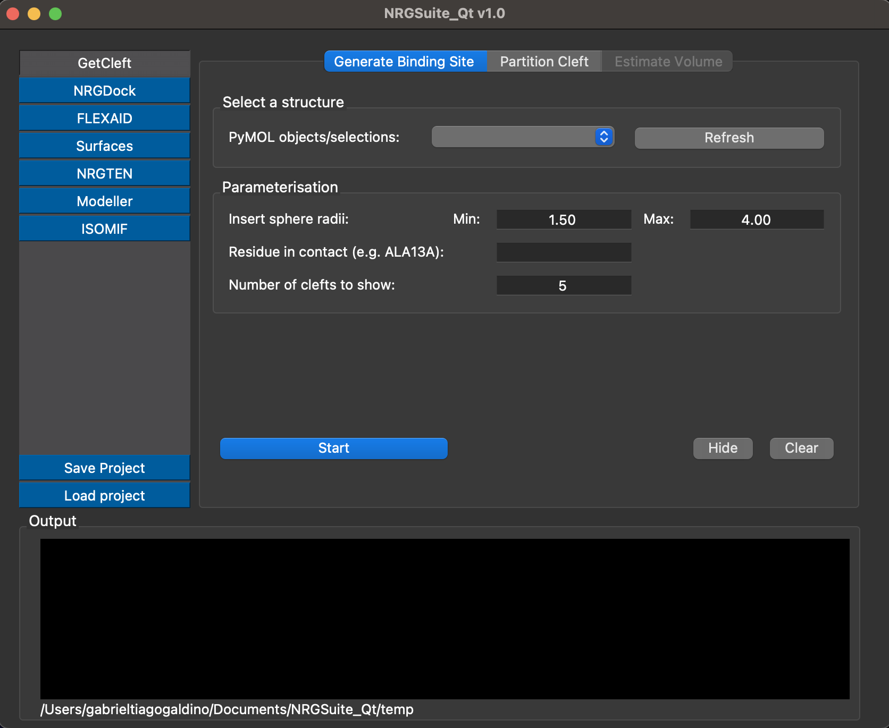
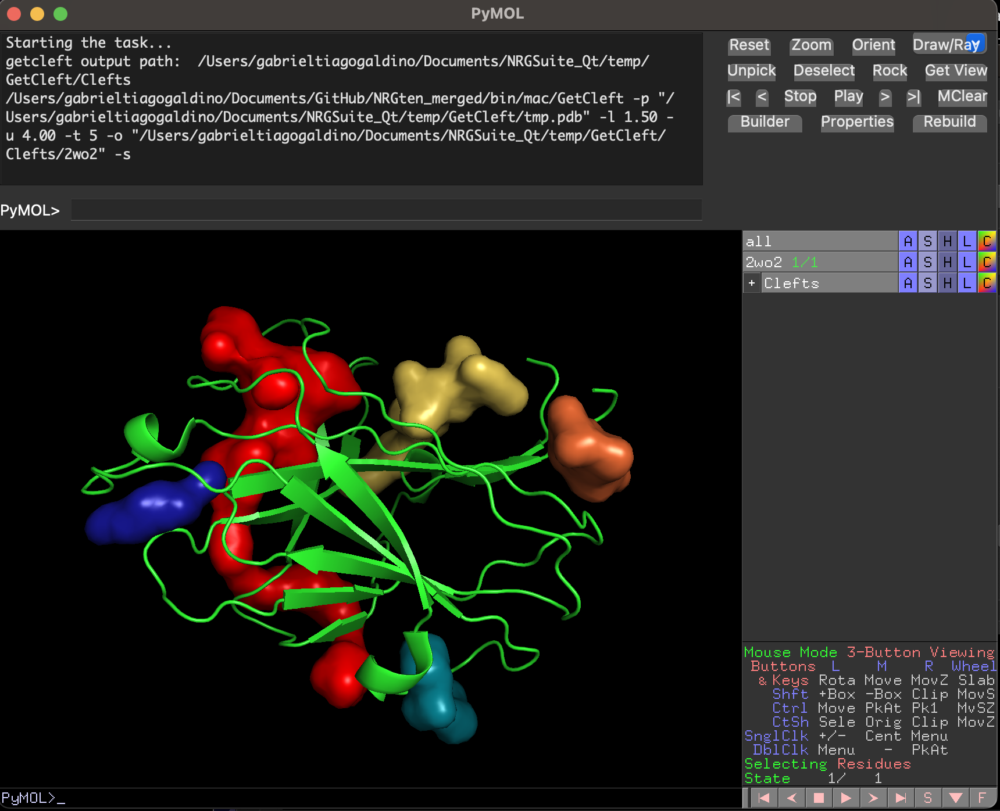

GetCleft
=====

.. _GetCleft:

The software **GetCleft** (https://github.com/NRGlab/Get_Cleft) was developed for detection of cavities and surface-exposed areas.
And it is used for biding site definition in FlexAID and NRGdock.
To use it, open the plug-in on the 'Plugin' menu in pymol click on the 'GetCleft' button in the left corner of the window.
Load the structure of the target in Pymol.
Press 'Refresh' in the 'Select a structure' session and the select the target in the 'PyMOL objects/selections:' list.

.. note::
    To understand better the parameters of GetCleft read the manual for NRGsuite: http://biophys.umontreal.ca/nrg/ewExternalFiles/NRGsuite_Guide.pdf

The parameters session:

The detection of cavities by GetCleft is based on the introduction of spheres in between pairs of atoms of the target and by reducing the volume of these spheres until no clashes are found.
Use the option 'Insert sphere radii'. By default (Recommended) Min: 1.50 and Max: 4.0.

If the user wants a specific residue to be in the detected cavity, they must enter the residue identification in the format: "Tree letter code + resinumber + chain". "e.g. ALA13A"

GetCleft will output the top N clefts defined in "Number of clefts to show" (default 5).

.. note::
    When a residue is indicated in the box, only the cavity containing the residue will be generated.

The generated clefts will be displayed in pymol and marked according to their volume:

