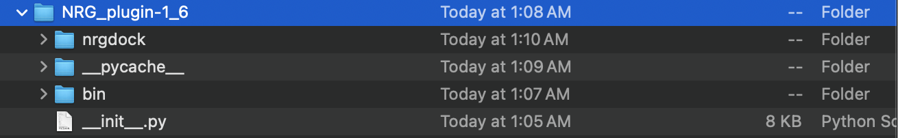

Installation
=====

.. _installation:

Pymol Installation
------------

MAC OS:

Open-Source PyMOL is available free of charge and may be readily installed via the Homebrew (recommended)

.. code-block:: console

   brew install brewsci/bio/pymol

WINDOWS INSTALL:

for windows install information refer to: https://pymolwiki.org/index.php/Windows_Install

LINUX INSTALL:

for linux install information refer to: https://pymolwiki.org/index.php/Linux_Install

Plug-in installation:
----------------

The source code of latest release of NRG_QT version is available at: https://github.com/ThomasDesc/NRG_plugin/releases/tag/v1_11

1. Download the "NRG_plugin-v_v.zip" file and extract it to a known directory.

2. Open Pymol interface and click in 'Plugin -> Plugin Manager -> Install New Plugin -> Choose file'.

.. image:: images/pymol_interface.png
       :alt: An example image
       :width: 300px
       :align: center

3. Go to the directory of the extracted source code and select the file '__init__.py' and click 'Open'.

4. Choose a directory for the installed plug-in. **IMPORTANT!** It must be **DIFERENT** from the extracted source code in step 1. macOS users must save this path and execute the steps in the note bellow Before proceeding with the installation .

.. image:: images/plug-inpath.png
       :alt: An example image
       :width: 300px
       :align: center

5. Close and re-open pymol. The plug-in must be listed as 'NRGSuite_QT' the 'Plugin' menu and should be listed in the 'Installed Plugins' list in the 'Plugin Manager' window.

.. image:: images/pluginlisted.png
    :alt: An example image
    :width: 300px
    :align: center

.. note::
    For macOS users: After installing the plug-in, go to the directory of the installed plugin, open the bin folder and double click on each of the precompiled versions of 'GetCleft','FlexAID','vcon' and 'Process_Ligand'
    .. image:: images/macOS_bin.png
        :alt: An example image
        :width: 300px
        :align: center

    a pop-up window may appear, click in open:
    .. image:: images/macOS_pop_up.png
        :alt: An example image
        :width: 300px
        :align: center
    A terminal window will open each time you double click each one of the executables, close it and proceed with the installation.

