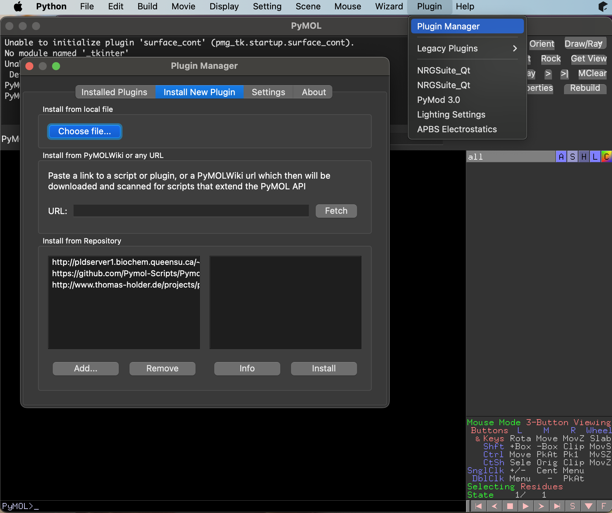
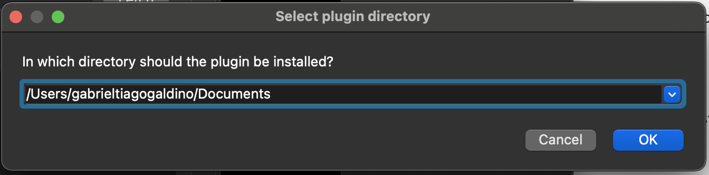
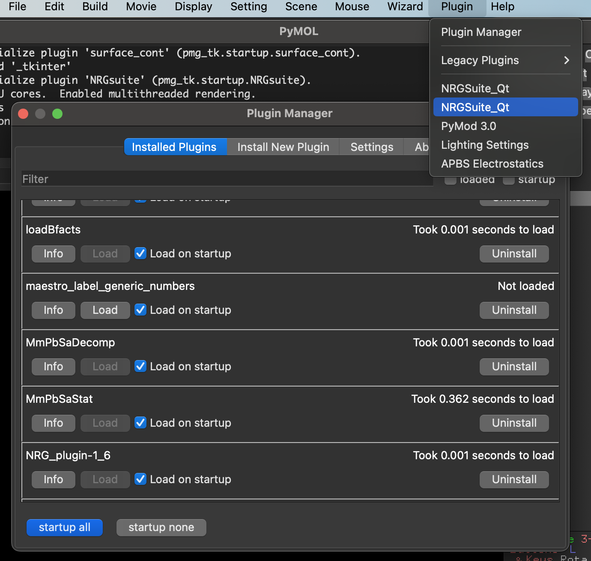

Installation
=====

.. _installation:

Pymol Installation
------------

.. note::
    For macOS users: In your 'System Settings' in the session 'Private and Security' menu the option 'Allow applications from' should marked as 'App store and identified developers'.

    .. image:: images/sucrity_mac.png
        :alt: An example image
        :width: 300px
        :align: center

    For users of older MACs (not M1) open 'Terminal' and type command:

    .. code-block:: console

        mkdir -p ~/miniconda3
        curl https://repo.anaconda.com/miniconda/Miniconda3-latest-MacOSX-x86_64.sh -o ~/miniconda3/miniconda.sh
        bash ~/miniconda3/miniconda.sh -b -u -p ~/miniconda3
        rm ~/miniconda3/miniconda.sh

    and then after the installation:

    .. code-block:: console

        ~/miniconda3/bin/conda init bash
        ~/miniconda3/bin/conda init zsh

    close terminal and open it again.

Pymol installation will be done using Miniconda (https://docs.anaconda.com/miniconda/#quick-command-line-install )

Once miniconda was installed:

.. note::

    Windowns users: after installing, open the “Anaconda Prompt (miniconda3)” program to use Miniconda3.

.. code-block:: console

    conda install conda-forge::pymol-open-source

Modeller install:
The user should obtain a modeller license key at:
https://salilab.org/modeller/registration.html

and install modeller via conda:

.. code-block:: console

    conda config --add channels salilab
    conda install modeller

You will be prompted after installation to edit a file to add your Modeller license key.

Plug-in installation
----------------

The source code of latest release of NRG_QT version is available at: https://github.com/ThomasDesc/NRG_plugin/releases/

1. Download the "NRGSuite_Qt.zip" (macOS) or "Source code (zip)" (for Windows) in a known directory.

2. Open Pymol interface and click in 'Plugin -> Plugin Manager -> Install New Plugin -> Choose file'.

3. Go to the directory of the source code and select 'NRGSuite_Qt.zip'  and click 'Open'.

.. note::
    If the file was downloaded via Safari and the zip was extracted and doesn't exist in the directory. Go to the extracted directory and click on the file '__ini__.py'.

    .. image:: images/inifig.png
       :alt: An example image
       :width: 300px
       :align: center

4. Choose a directory for the installed plug-in.

5. Close and re-open pymol. The plug-in must be listed as 'NRGSuite_QT' the 'Plugin' menu and should be listed in the 'Installed Plugins' list in the 'Plugin Manager' window.

