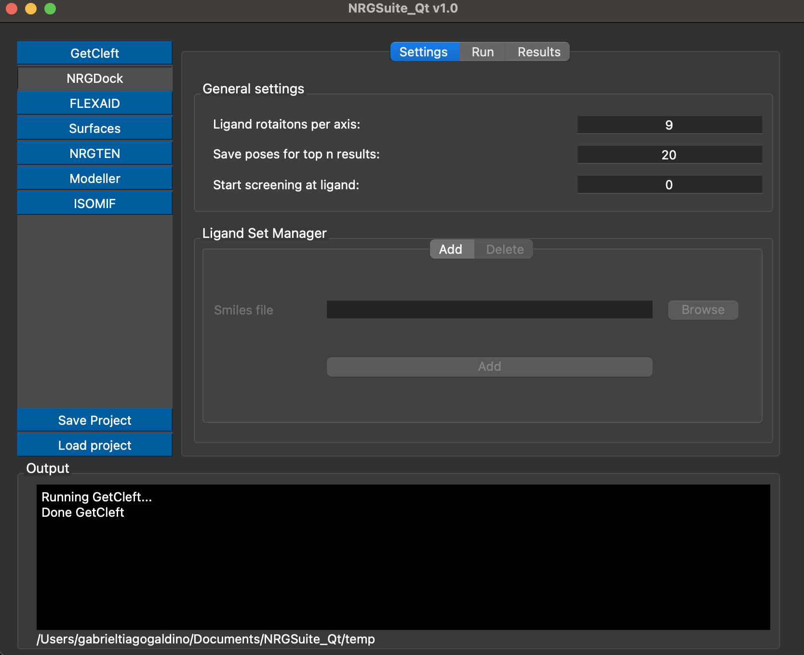

.. _NRGDock:

NRGDock
=====
**NRGDock** is a software developed for ultra-massive-high-trough-put screening using a scoring function derivated from FlexAID.

.. note::
    To use NRGdock the target object and target cleft (see how to generate clefts in :doc:`GetCleft`) should be loaded in pymol interface.

    .. image:: _static/images/NRGDock/recep-cleft-nrgdock.png
       :alt: An example image
       :width: 700px
       :align: center

General settings
------------

Click on the button 'NRGDock' on the left menu of the plugin. In the tab 'Settings':
In the session 'General settings', select the number of 'Ligand rotations per axis' (default and recommend: 9) .
Mark the box 'Saves Pose(s)' to select the number of poses to be saved in '.pdb' format in the end of the simulation (by default no poses are saved since NRGdock poses are an approximation and not always realistic).

Ligands sets
------------

By default, two common data sets of are provided: 'DrugBank FDA' containing of all FDA approved drugs available in Drugbank(https://go.drugbank.com/ ) and 'PDB' containing all small molecules available in the Chemical Component Dictionary (https://www.wwpdb.org/data/ccd ). The list of all other ligands to be tested should be provided in a file in smiles format ('.smi') and added in the session 'Ligand set manager'.
Add the smiles file path to the box 'Smile file' or click in browse to load it via file manager. Press Add to this set to your list of ligand sets.

This set can be removed when no longer needed in the tab 'Delete' in the same session, by pressing the button refresh and selecting the Ligand set to be deleted in the 'Available ligand sets' box.

.. image:: _static/images/NRGDock/delete_sets.png
       :alt: An example image
       :width: 700px
       :align: center

Running NRGdock
------------
To run 'NRGdock' click on the tab 'Run' in 'NRGdock' interface.
Press the button 'Refresh' in the 'Target' list and select the target object previously loaded in pymol.
Press the button 'Refresh' in the 'Ligand set' list and select the ligand set to be tested (previously added at :ref:`Ligand sets`).
Press the button 'Refresh' in the 'Binding site' list and select the cleft object previously loaded in pymol (see: :doc:`GetCleft`).
To start the simulation press the button 'Start'.
The progress of the simulation can be monitored using the 'Progress' bar and the 'Ligand' counter showing 'ligands tested / total ligands in the ligand set'.

.. image:: _static/images/NRGDock/run_tab_nrgdock.png
       :alt: An example image
       :width: 700px
       :align: center