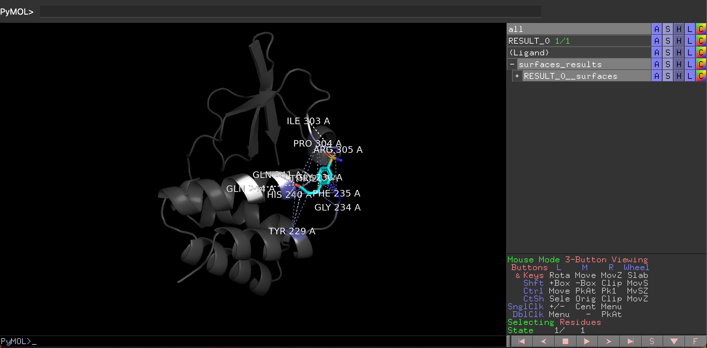

.. _Surfaces:

Surfaces
======

Surfaces (https://academic.oup.com/bioinformatics/article/39/10/btad608/7288175 ) comprises a collection of Python scripts that provide a rapid means to assess protein interactions by analyzing the atomic surface areas in contact and the types of atoms involved in the interaction.
We implemented surfaces in NRG-QT in order to analyse the ligand/target interactions after running FlexAID.

.. note::

    In order to run Surfaces, one need to run FlexAID in advance and **do not delete the RESULT_n object**

Select surfaces in the main menu on the left corner of the plug-in. Press 'Refresh' and select the FlexAID result in 'Result to run surfaces on' list. Press the button 'Run Surfaces'.

.. image:: images/surf_menu.png
       :alt: An example image
       :width: 300px
       :align: center

The visual of surfaces will be shown in the pymol window.

