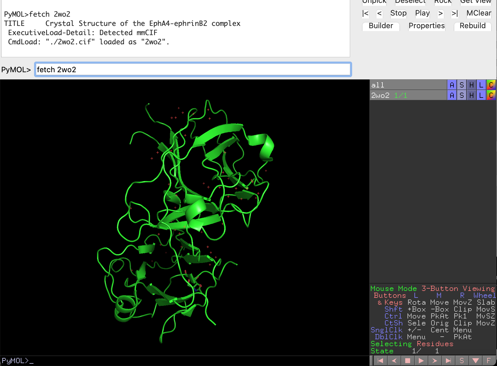
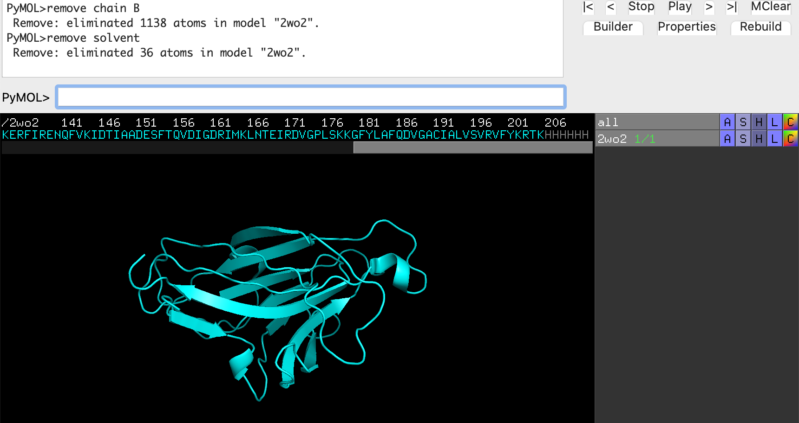
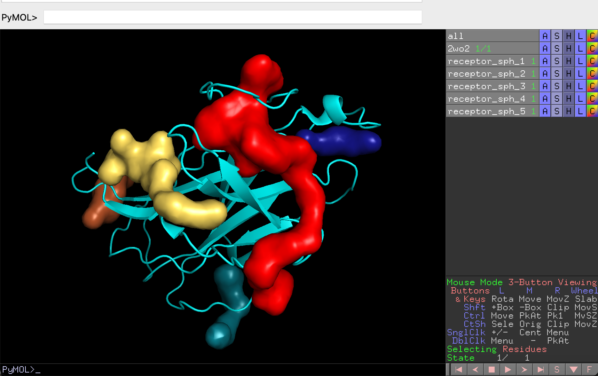
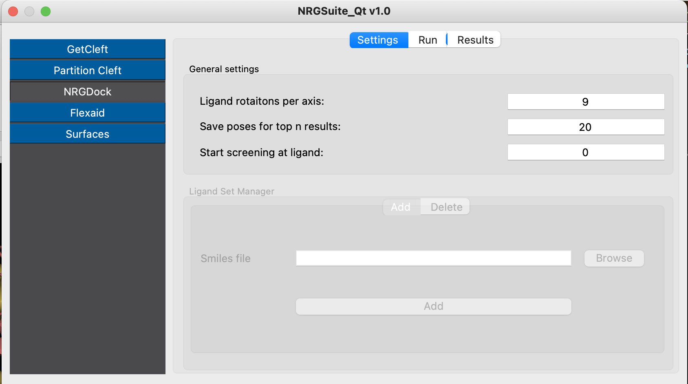
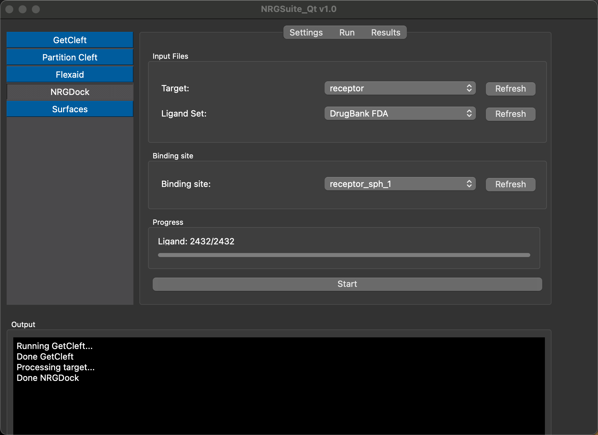

.. _Tutorial:

Tutorial
=====

For this tutorial, we will be reproducing the results of Gu S. et al. 2018 (https://www.nature.com/articles/s41598-018-25790-1 ).
In their work they searched in a data set of FDA approved drugs inhibitors of the receptor tyrosine kinase erythropoietin-producing hepatocellular A4 (EphA4).
This receptor was identified as a molecular target for Alzheimer’s disease (AD). They selected and tested 22 molecules found 5 potential inhibitors of EphA4.
Specifically, nilotinib (https://go.drugbank.com/drugs/DB04868 ), a kinase inhibitor, inhibited the binding of EphA4 and ephrin-A at micromolar scale in a dosage-dependent manner.
In this tutorial, we are going to use a structure of EphA4 (PDB code: 2wo2, https://www.rcsb.org/structure/2WO2 ), same structure Gu S. et. al. used in their work.

Preparing the target
------------

Open pymol and run the command:

.. code-block:: console
    fetch 2wo2

The structure of the target should appear in pymol window.
We now follow the preparation steps for the docking, removing the EPHRIN-B2 chain and removing water molecules.
Run the command:

.. code-block:: console
    remove chain B
    remove solvent

Defining binde site area of Eph4
------------

Open the NRGqt plugin in the manu of plugins of pymol and click on the button 'GetCleft' (see :doc:`GetCleft`). Click on 'Refresh' and select '2wo2' and press play.

5 clefts should be loaded in the pymol interface.
The cleft of biggest volume 'receptor_sph_1' is the one we will be using for our docking experiments.

Running FDA-approved-drugs Ligand-set on Eph4
------------

In the Plugin interface, click on the button 'NRGdock' on the left corner of the plugin. Click on the tab 'Settings'.

Set the number of 'Save poses for top n results' to 20 (so we can have the structure of the TOP20 molecules). We expect that nilotinib (code: DB04868) the inhibitor identified in the paper, to be ranked among the best scored ligands of the 'DrugBank FDA' ligand set, so it should be ranked among the top 20 best ligands.

The ligand rotations will remain 9 (default)

Click on the tab 'Run'

