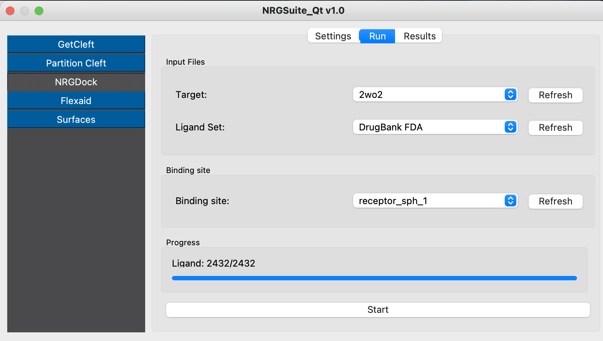
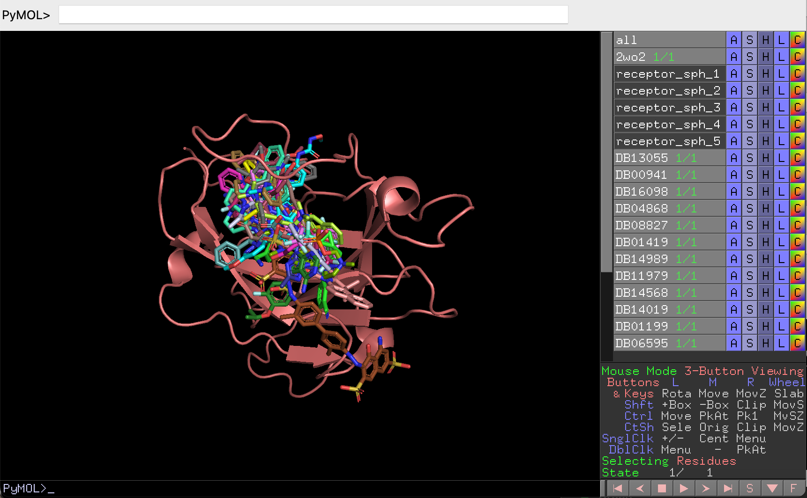
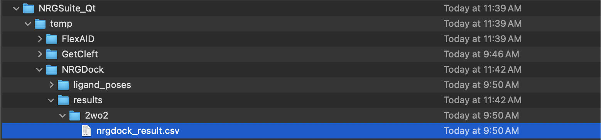
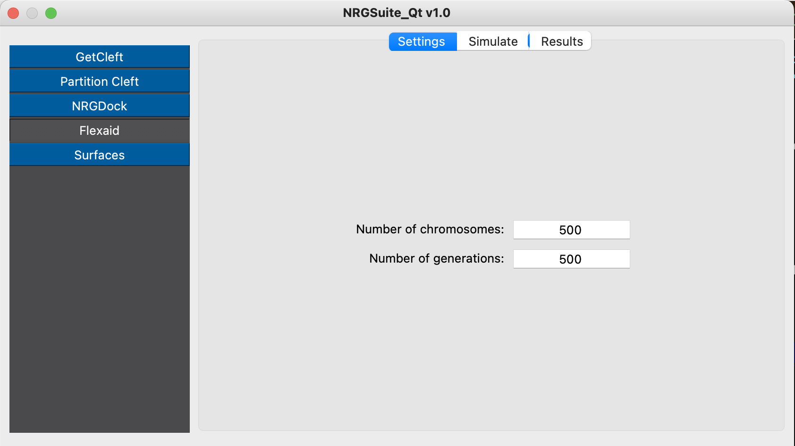
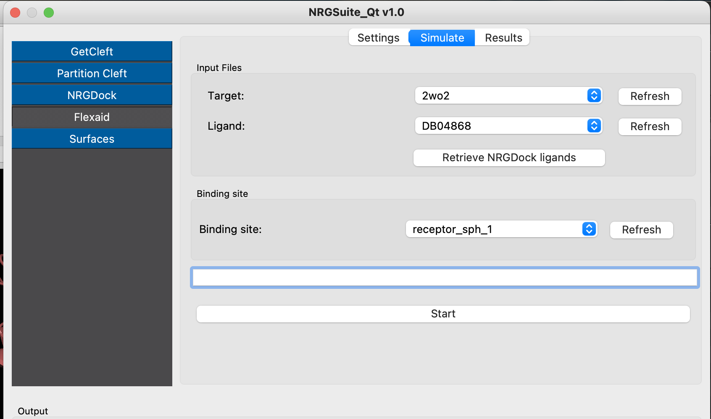
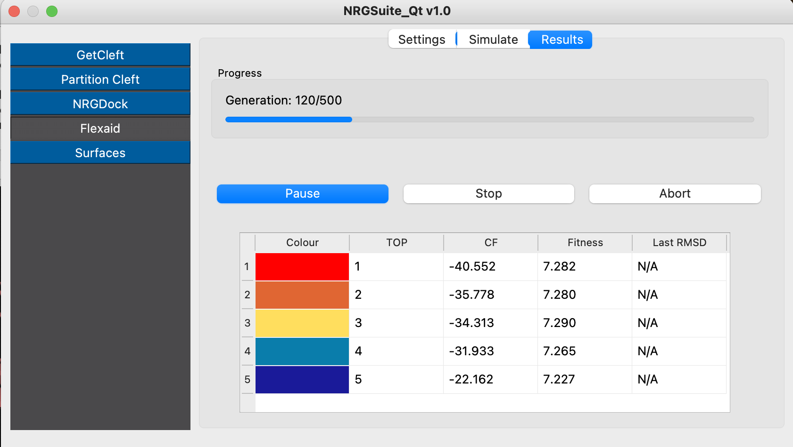
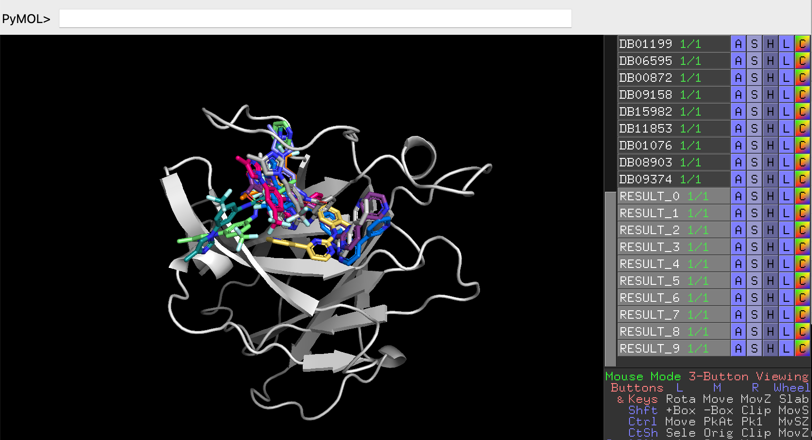
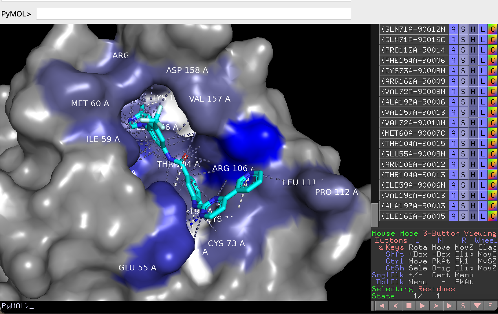
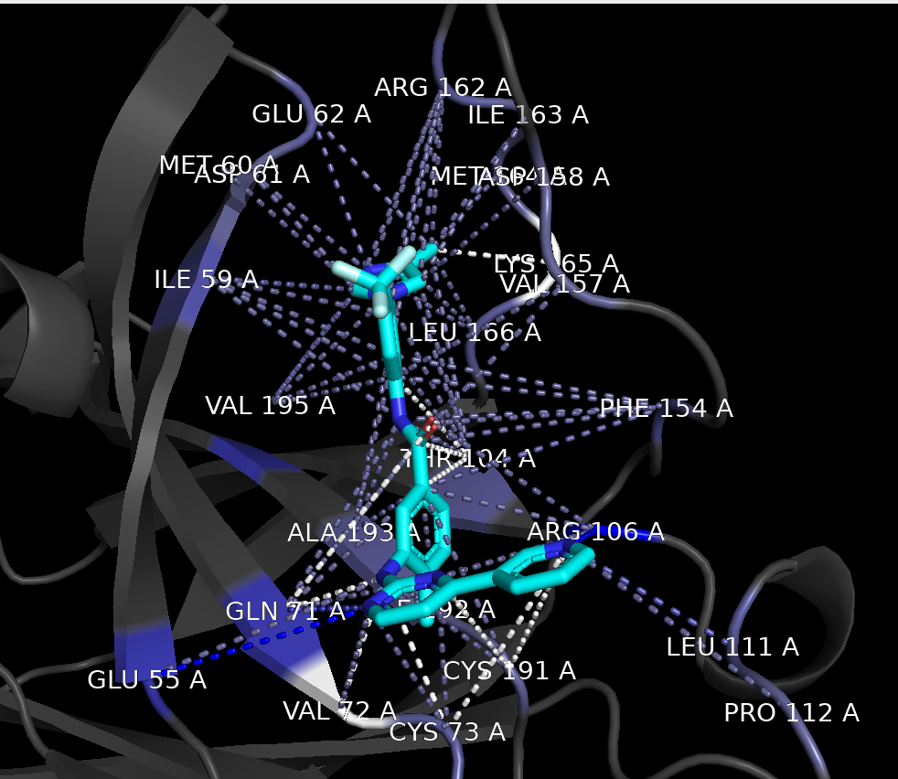

.. _Tutorial:

Tutorial
========

In this tutorial, we will reproduce the results of Gu S. et al. 2018 (https://www.nature.com/articles/s41598-018-25790-1). In their work, they searched a dataset of FDA-approved drugs for inhibitors of the receptor tyrosine kinase erythropoietin-producing hepatocellular A4 (EphA4). This receptor was identified as a molecular target for Alzheimer’s disease (AD). They selected and tested 22 molecules and found 5 potential inhibitors of EphA4. Specifically, nilotinib (https://go.drugbank.com/drugs/DB04868), a kinase inhibitor, inhibited the binding of EphA4 and ephrin-A at a micromolar scale in a dose-dependent manner. In this tutorial, we are going to use a structure of EphA4 (PDB code: 2wo2, https://www.rcsb.org/structure/2WO2), the same structure Gu S. et al. used in their work.

Preparing the Target
--------------------

Open PyMOL and run the command:

.. code-block:: console

        fetch 2wo2

.. image:: images/fetch.png
       :alt: An example image
       :width: 300px
       :align: center

The structure of the target should appear in the PyMOL window.
We now follow the preparation steps for docking, removing the EPHRIN-B2 chain and water molecules.
Run the commands:

.. code-block:: console

    remove chain B
    remove solvent

.. image:: images/remove_chains.png
       :alt: An example image
       :width: 300px
       :align: center

Defining Binding Site Area of EphA4
-----------------------------------

Open the NRGqt plugin from the PyMOL plugin menu and click on the button 'GetCleft' (see :doc:`GetCleft`). Click 'Refresh', select '2wo2', and press 'Play'.

Five clefts should load in the PyMOL interface.
The cleft with the largest volume, 'receptor_sph_1', is the one we will use for our docking experiments.

.. image:: images/clefts_tutorial.png
       :alt: An example image
       :width: 300px
       :align: center

Running the FDA-Approved-Drugs Ligand Set on EphA4 (this can take up to 30 minutes on certain laptops)
------------------------------------------------------------------------------------------------------

In the plugin interface, click the 'NRGdock' button in the left corner. Go to the 'Settings' tab.

Set the number of 'Save poses for top n results' to 20 (so we can have the structures of the top 20 molecules). We expect that nilotinib (code: DB04868), the inhibitor identified in the paper, will be ranked among the best-scored ligands of the 'DrugBank FDA' ligand set, so it should appear among the top 20 ligands.

The ligand rotations will remain at 9 (default).

.. image:: images/settings_nrgdock_tut.png
       :alt: An example image
       :width: 300px
       :align: center

Click the 'Run' tab. Press 'Refresh' on the target list and select '2wo2'. Press 'Refresh' in the 'Binding site' list and select 'receptor_sph_1'. Press 'Run' and wait until the progress bar is full.

.. note::

    For Windows users: When NRGdock is running it may free pymol window. **Don't click on it***

The top 20 ligands will be plotted in the PyMOL interface. Search for 'DB04868'—this is the pose generated by NRGdock.

You can access the complete list of results of NRGdock by opening the '.csv' file in the 'temp' directory of 'NRGsuite_QT' in documents.

To obtain a more realistic pose of the nilotinib/EphA4 complex, we will re-do the docking simulation for nilotinib using FlexAID.

Performing Docking of Nilotinib Using FlexAID
---------------------------------------------

Click the 'FlexAID' button in the left corner menu. Go to the 'Settings' tab. Set the 'Number of chromosomes' to 500 and 'Number of generations' to 500.

Go to the 'Simulate' tab. Press 'Refresh' in the target list, ligand list, and bind-site list. Select '2wo2' as the target, 'DB04868' as the ligand, and 'receptor_sph_1' as the target cleft.

The 'Results' tab will open automatically. The progress bar will indicate the progress of the simulation and list the top 5 best ligand poses and their scores (CF, most negative -> better scoring).

The top 10 results will be plotted in the PyMOL interface:

.. note::
    Some windows users may not be capable of running FlexAID properly. So we added a pre-processed version of the docked nilotinib.
    on the surfaces interface. Click the button 'Browse' and select: 'RESULT_0.pdb'

Visualizing Nilotinib/EphA4 Interactions with Surfaces
------------------------------------------------------

We will now run the Surfaces for the best pose. Click the 'Surfaces' button in the menu. Click 'Refresh' and select 'Result_0'. Press 'Run Surfaces'.

.. image:: images/surf_menu.png
       :alt: An example image
       :width: 300px
       :align: center

A list view of all interactions is shown in the PyMOL interface.

To better visualize the interactions, run the following command in PyMOL:

.. code-block:: console

    hide surface

In the article the authors say: 'Nilotinib is predicted to form hydrogen bonds with Q70 in the D-E loop and T104 as well as hydrophobic interactions with F154, V157, I163, L166, A193, and V195.'
